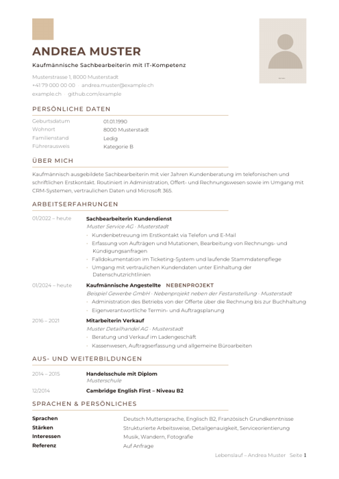

# Bewerbungs-Generator

Ein Werkzeugkasten für Schweizer Bewerbungsunterlagen: Lebenslauf als Word-Datei,
Bewerbungsschreiben als PDF, beides aus versionierbaren Datendateien statt aus
einer gewachsenen Word-Vorlage.

Entstanden während einer echten Stellensuche. Der interessantere Teil ist nicht
der Code, sondern die Regeln in [`docs/regeln.md`](docs/regeln.md) — sie
verhindern, dass eine KI beim Zuschneiden auf ein Inserat Erfahrung erfindet,
die man nicht hat.



## Was dabei herauskommt

| Dokument | Format | Werkzeug |
|---|---|---|
| Lebenslauf | `.docx`, daraus PDF | Node.js mit `docx` |
| Bewerbungsschreiben | `.pdf` | Python mit ReportLab |

Beide teilen ein Farbschema (Sandton `#D8BFA0`, Braun `#64493E`), eine feine
Linienstärke und eine Bildsprache, ohne gleich auszusehen. Der Lebenslauf ist
einspaltig und maschinenlesbar, das Anschreiben ein klassischer
Geschäftsbrief.

## Voraussetzungen

Das hier ist kein fertiges Programm, sondern zwei Skripte. Ohne die folgenden
Dinge laufen sie nicht. Die beiden Dokumente sind voneinander unabhängig: der
Brief braucht nur Python, der Lebenslauf nur Node.

| Wofür | Was genau | |
|---|---|---|
| Bewerbungsschreiben | **Python 3.10+** mit `reportlab` und `pillow` | Pflicht |
| Bewerbungsschreiben | Schrift **Carlito** oder **Calibri** | Pflicht |
| Lebenslauf | **Node.js 18+**, danach `npm install` | Pflicht |
| Lebenslauf | Schrift **Montserrat** in fünf Schnitten | Pflicht |
| .docx öffnen und nachbearbeiten | **Microsoft Word** oder **LibreOffice Writer** | Pflicht |
| Schriften einbetten | Python plus die TTF-Dateien | empfohlen |
| .docx nach PDF wandeln | LibreOffice oder Word | empfohlen |
| Sichtprüfung als Bild | `pypdfium2` (pip) oder poppler-utils | empfohlen |

Zwei Dinge, über die man sonst stolpert:

**Der Lebenslauf ist eine Word-Datei.** Ohne Word oder LibreOffice lässt er
sich weder ansehen noch korrigieren noch in ein PDF wandeln. Viele
Bewerbungsportale wollen am Ende ein PDF.

**Ohne die Schriften kommt Unsinn heraus.** Fehlt Carlito, bricht der
Brief-Generator ab. Fehlt Montserrat, ersetzt Word sie stillschweigend durch
irgendetwas anderes, und das Layout verschiebt sich. Deshalb der Schritt
„Schriften einbetten" weiter unten.

Vollständige Installationsbefehle für Windows, Linux und macOS stehen in
[`docs/setup.md`](docs/setup.md).

## Schnellstart

```bash
git clone https://github.com/mardoommo/bewerbungs-generator.git
cd bewerbungs-generator

# Bewerbungsschreiben als PDF
pip install reportlab pillow
python3 generator/brief_rl.py beispiel/brief_beispiel.py ausgabe/Bewerbung.pdf

# Lebenslauf als Word-Datei
npm install
cd generator/cv
node word_cv.js ../../beispiel/cv_beispiel.json ../../ausgabe/CV.docx
```

Unter Windows heisst der Python-Befehl `python` statt `python3`, und in
PowerShell braucht es `npm.cmd install` statt `npm install`.

## Aufbau

```
generator/
  brief_rl.py            Anschreiben als PDF (ReportLab)
  brief_style.css        Massangaben des Briefes, Referenz für brief_rl.py
  grafik.py              Hintergrundgrafiken als SVG-Pfade
  export_brief.py        Briefdaten nach JSON, für die Word-Variante
  schriften_einbetten.py bettet Schriften in eine .docx ein
  unterschrift.png       Platzhalter, durch eigene Unterschrift ersetzen
  cv/
    word_cv.js           Lebenslauf als .docx
    accent_square.png    Akzentquadrat oben links
    foto_portrait.png    Platzhalter, durch eigenes Foto ersetzen
beispiel/
  brief_beispiel.py      vollständiges Anschreiben einer erfundenen Person
  cv_beispiel.json       vollständiger Lebenslauf derselben Person
docs/
  regeln.md              Grundregel: nichts erfinden
  stilvorlage.md         wie man die eigene Schreibstimme festhält
  keywords.md            Begriffe aus dem Inserat spiegeln, ohne zu lügen
  setup.md               Installation, Schriften, Stolpersteine
```

## Eigene Daten

Die Beispieldateien gehören einer erfundenen Andrea Muster. Kopieren,
umbenennen, mit eigenen Angaben füllen:

```bash
cp beispiel/cv_beispiel.json daten/cv_kv.json
cp beispiel/brief_beispiel.py daten/brief_firmaxy.py
```

Lege `daten/` an und halte es aus dem Repository heraus — die `.gitignore`
sieht das bereits vor. Foto und Unterschrift ersetzen, ohne sie zu committen.

Empfohlen: zwei Quell-Lebensläufe pflegen, etwa einen kaufmännischen und einen
technischen. Jede Bewerbung leitet sich aus dem passenden ab. Nie eine
verkürzte Neuversion bauen — Struktur und Stationen bleiben, nur die
Gewichtung ändert sich.

## Der Aufbau eines Anschreibens

Das Beispiel folgt einem Muster, das sich über viele Briefe herausgebildet hat:

1. **Konkrete Tätigkeit mit persönlicher Note**, verankert in einer Station.
   Nicht «Hiermit bewerbe ich mich», nicht «Ihre Firma begeistert mich».
2. **Dieselbe Arbeit konkret ausgeführt**, mit einem harten Beleg — eine Zahl,
   eine Auszeichnung, ein nachprüfbares Ergebnis.
3. **Ausbildung und Werkzeuge.**
4. **Bezug auf die Ausschreibung**, dazu Pensum und Eintritt.
5. **Ein Satz Gesprächswunsch.**

Rund 200 Wörter, höchstens eine Seite. Was nicht hineinpasst, steht im
Lebenslauf.

## Grundregel

> Jede Aussage muss aus den eigenen Unterlagen oder den eigenen Worten
> stammen. Die Stellenanzeige ist keine Quelle. Anpassen heisst auswählen,
> umsortieren und weglassen — nicht neue Sätze über Erfahrung erfinden, die
> man nicht hat.

Ausführlich in [`docs/regeln.md`](docs/regeln.md). Wer mit einem
Sprachmodell arbeitet, gibt ihm diese Datei zuerst.

## Lizenz

MIT, siehe [LICENSE](LICENSE). Der Code ist frei verwendbar. Schriften und
eigene Bilddateien bringst du selber mit.
